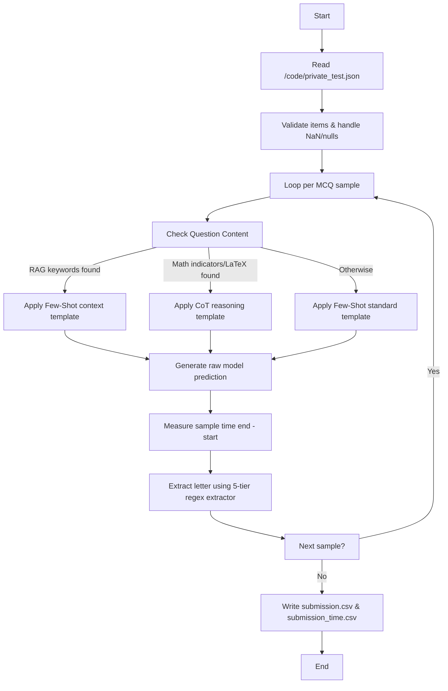

# Vietnamese Student HackAIthon 2026 - Bảng C (Innovator) - Team [Tên_Đội_Của_Bạn]

This repository contains the source code, Docker configs, and optimization engines for the Track C - INNOVATOR project in the Vietnamese Student HackAIthon 2026.

## 1. Pipeline Flow

The system runs end-to-end starting from reading raw MCQ files to outputting predicted answers and latencies.



- **Prompt Routing Engine**: Automatically routes Math-heavy inputs to a multi-turn Chain-of-Thought (CoT) template and RAG-heavy/factual questions to a few-shot retrieval-aligned context template.
- **5-Tier Regex Extractor**: Post-processes model generation to extract the correct MCQ option `{A, B, C, D}` and filters out markdown bold tags, bracket variations, or conversational Vietnamese prefixes.

---

## 2. Data Processing

All questions from the JSON dataset are defensively processed through the [data_loader.py](file:///e:/HackAIthon/src/utils/data_loader.py) module:
- **Encoding Force**: Every file I/O operations are locked to `UTF-8` explicitly to prevent OS-level CP1252 exceptions.
- **Validation check**: Each question item is parsed to ensure existence of `qid`, non-empty `question` text, and a valid `choices` list (must be a list with at least 2 items). Any malformed rows are skipped and logged, or fall back to default answer "A" without crashing the entire run.
- **Truncation Guard**: To stay within the context window limits, the prompt builder truncates long passages gracefully, keeping execution VRAM footprint safe.

---

## 3. Resource Initialization

### Model Weights
- **Model**: `Qwen/Qwen2.5-3B-Instruct` (parameter size is compliant with the $\le$ 5B rule).
- The model weights are automatically downloaded from Hugging Face Hub during Docker build (or mounted locally at runtime).
- GPU acceleration uses `vLLM` with PageAttention and KV-caching. Windows/CPU execution falls back to PyTorch Hugging Face pipelines for local dry-run debugging.

### Environment Setup
1. Clone the repository.
2. Initialize local CodeGraph index:
   ```bash
   codegraph init
   ```
3. Run the validation checks locally:
   ```bash
   python scripts/run_full_validation.py --pred submission.csv --dry-run
   ```

---

## 4. Run Guide (Docker Production Build)

Follow the official BTC checklist to build and verify the container:

### Step A: Build the Docker Image
```bash
docker build -t team_submission .
```

### Step B: Run the Container (Local Test)
Mount your local data directory containing `private_test.json` to `/code/` (or `/app/data/`):
```bash
docker run --gpus all \
  -v /path/to/data:/code \
  team_submission
```

Verify that the output files `submission.csv` and `submission_time.csv` are generated successfully in the mounted path.
