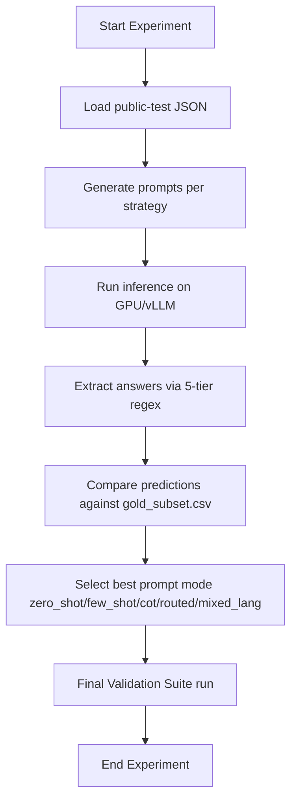

# Workflow: Prompt Optimization Loop

This document defines the iterative loop to evaluate prompting templates, measure classification routing accuracy, and select the optimal model configuration.



## Step 1: Initialize Gold Labels
Make sure a representative subset of questions has ground truth labels defined inside `data/gold_subset.csv`.
If the subset is not initialized, run:
```bash
python scripts/create_gold_subset.py
```
And manually populate the correct answers (`A`, `B`, `C`, `D`).

## Step 2: Run Comparison Benchmark
Execute the comparison harness across all 5 strategies on the selected model:
```bash
python scripts/compare_prompts.py --model Qwen/Qwen2.5-3B-Instruct
```
This script runs zero-shot, few-shot, Chain-of-Thought, mixed language, and heuristically routed modes, measuring overall accuracy and throughput.

## Step 3: Analyze Reports
- The script automatically writes detailed analysis results to `docs/prompt_experiment_results.md`.
- Inspect the output to identify classification/extraction failures and check which mode gives the highest accuracy score.

## Step 4: Configure Production Setting
Once the optimal prompt mode is selected:
1. Update default `--prompt_mode` parameter inside `src/main.py`.
2. Re-run validation to ensure format safety is fully preserved.
